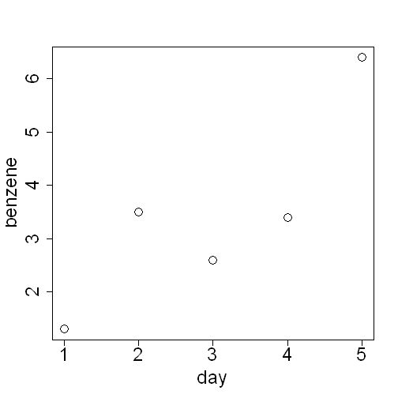
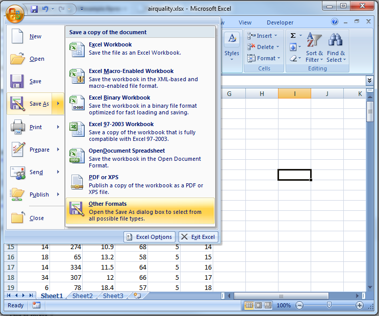
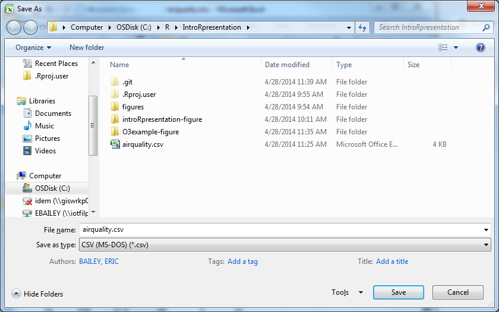
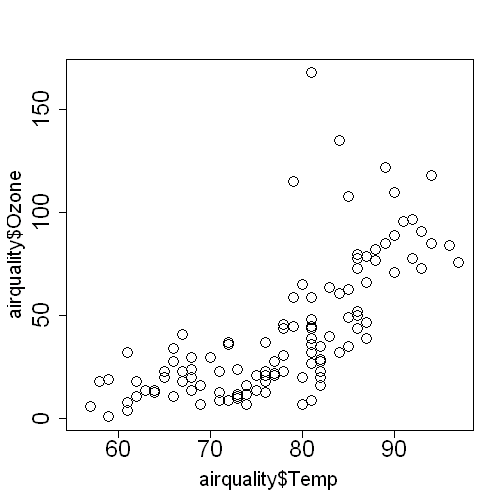
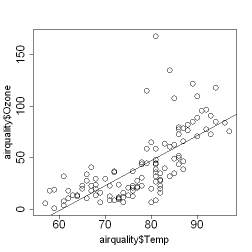
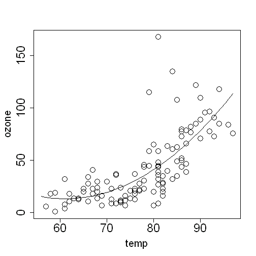
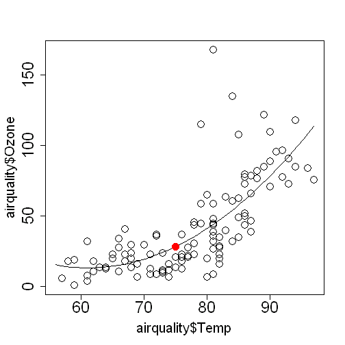

Introduction to R
========================================================
author: Nathan Byers, Eric Bailey, Kali Frost
date: April 28, 2014
navigation: section


Topics
========================================================

- [R and RStudio](#/RRStudio)
- [R basics](#/Rbasics)
- [Using R packages](#/packages)
- [Importing  data](#/import)
- [Data exploration](#/exploration)


R and RStudio
========================================================
type: section
id: RRStudio


R and RStudio
========================================================
- This section covers the two pieces of software you need to download
- R is the core piece
- RStudio is a nice integrated development environment (IDE) that makes it much easier to use R

R
========================================================
type: sub-section
- R is a <a href="http://www.r-project.org/" target="_blank">free, open-source language and environment</a> for statistical analysis
- It's been very popular in academia for more than a decade
- R is becoming <a href="http://r4stats.com/articles/popularity/" target="_blank">more popular</a> outside of academia, including industry and government

R
========================================================
- To download R for Windows, <a href="http://cran.r-project.org/bin/windows/base/" target="_blank">see this page</a>
- If you open R itself, it will look very plain


RStudio
========================================================
type: sub-section
- RStudio makes R a little more user friendly
- It's free and can be downloaded at <a href="http://www.rstudio.com" target="_blank">rstudio.com</a>
- It's not necessary to open RStudio to use R, but in these slides we will assume that  RStudio is your interface to R

RStudio
========================================================
When you first open RStudio, this is what you see


RStudio
========================================================
- The left panel is the console for R
- Type `1 + 1` then hit "Enter" and R will return the answer


RStudio
========================================================
- It's a good idea to use a script so you can save your code
- Open a new script by selecting "File" -> "New File" -> "R Script" and it will appear in the top left panel of RStudio


RStudio
========================================================
- This is basically a text document that can be saved (go to "File" -> "Save As")
- You can type and run more than one line at a time by highlighting and clicking the "Run" button on the script tool bar


RStudio
========================================================
- The bottom right panel can be used to find and open files, view plots, load packages, and look at help pages
- The top right panel gives you information about what variables you're working with during your R session
- We'll explain more about what to look for in those panels later

R basics
========================================================
type: section
id: Rbasics


Doing math
========================================================

- Open up a script if you haven't already ("File" -> "New File" -> "R Script") 
- Try some math by either typing the lines below or copying and pasting the lines into your script


```r
10 + 5
10 - 5
10 * 5
10 / 5
```


- Remember, to run the lines, highlight your code and click the "Run" button on the toolbar of the script panel

Creating a variable
========================================================
left: 70%
- A variable is a symbol that can take many different values
- To create a variable in R we use an arrow symbol pointing left `<-`
- On the right we've created the variables `x` and `y` by assigning some numbers to them

***


```r
x <- 10
y <- 5
x + y
```

```
[1] 15
```

<font size="6">(Above, the top panel is what you run in your script, the bottom panel is the output)</font>

Creating a variable
========================================================
In RStudio, you will see the variables we created in the top right panel


Creating a variable
========================================================
- If you've already created a variable, you can replace the value with another value

```r
x
```

```
[1] 10
```


```r
x <- 20
x
```

```
[1] 20
```


Creating a variable
========================================================
In the top right panel you can see that the number stored in the variable `x` has changed


Variable types
========================================================
R has three main variable types

Type | Description | Examples
------|--------|--------
`character` | letters and words |`"z"`, ` "red"`, ` "H2O"`
`numeric` | numbers | `1`, ` 3.14`, ` log(10)`
`logical` | binary | `TRUE`, ` FALSE`

Grouping Data
========================================================

There are several ways to group data to make them easier to work with:
* Vectors - contain multiple values of the same type (e.g., all numbers or all words)
* Lists - contain multiple values of different types (e.g., some numbers and some words)
* Matrix - a table, like a spreadsheet, with only one data type
* Data Frames - Like a matrix, but you can mix data types

Vectors
========================================================
- Vectors are variables with an ordered set of values
- They contain only one type of data (numeric, character, or logical)
- We use `c( )` as a container for vector elements


```r
x <- c(1, 2, 3, 4, 5)
x
```

```
[1] 1 2 3 4 5
```


Lists
========================================================
- Lists are like vectors but can contain any mix of data types
- We use `list()` as a container for list items


```r
x <- list("Benzene", 1.3, TRUE)
x
```

```
[[1]]
[1] "Benzene"

[[2]]
[1] 1.3

[[3]]
[1] TRUE
```


Data frames
========================================================
- Data frames are spreadsheet-like tables in R
- We use `data.frame()` as a container for many vectors of the same length

```r
pollutant <- c("Benzene", "Toluene", "Xylenes")
concentration <- c(1.3, 5.5, 6.0)
carcinogen <- c(TRUE, FALSE, FALSE)
my.data <- data.frame(pollutant, concentration, carcinogen)
my.data
```

```
  pollutant concentration carcinogen
1   Benzene           1.3       TRUE
2   Toluene           5.5      FALSE
3   Xylenes           6.0      FALSE
```


Functions
========================================================
- Functions are a way to repeat the same task on different data
- R has many built-in functions that perform common tasks

```r
x <- c(4, 8, 1, 14, 34)
mean(x) # Calculate the mean of the data set
```

```
[1] 12.2
```


```r
y <- c(1, 4, 3, 5, 10)
mean(y) # Mean of a different data set
```

```
[1] 4.6
```


Note on commenting
========================================================
- To write a comment in your script that will not be evaluated, type `#` in front of your comment
- The text after`#` will not be evaluated
- Run all of the code below and see what gets returned in the R console (bottom left panel in RStudio)

```r
# Full line comment
x # partial line comment
"new line"
```


Functions
========================================================
- Back to functions: they all have the form `function()`
- `function` is the name, which usually gives you a clue about what it does
- `()` is where you put your data or indicate options
- To see what goes inside `()`, type a question mark in front of the function and run it

```r
?mean()
```


Functions
========================================================
In RStudio, you will see the help page for `mean()` in the bottom right corner


Functions
========================================================
- On the help page, under `Usage`, you see `mean(x, ...)`
- This means that the only necessary thing that has to go into `()` is `x`
- On the help page under `Arguments` you will find a description of what `x` needs to be
- (For most purposes, you will want the `x` in the mean function to be a numeric vector)

Plotting 
========================================================
- Another example of a function is `plot()`
- At a minimum it takes two arguments, `plot(x, y)`
- `x` is a numeric vector that will be the x-axis coordinates of the plot
- `y` is a numeric vector (of the same length as `x`) that will be the y-axis coordinates of the plot

Plotting
========================================================

```r
benzene <- c(1.3, 4.5, 2.6, 3.4, 6.4)
day <- c(1, 2, 3, 4, 5)
plot(x = day, y = benzene)
```

Plotting
========================================================
 


Using R packages
=======================================================
type: section
id: packages

Using R packages
=======================================================
- R comes with basic functionality, meaning that some functions will always be available when you start an R session
- However, anyone can write functions for R  that are not part of the base functionality and make it available to other R users in a package
- Packages must be installed first then loaded before using it
- This is similar to a mobile app: you must first install the R package (like first downloading an app) then you must load the package before using its functions (like opening an app to use it)

Using R packages
=======================================================
- For example, lets say that R doesn't have a function you need
- The best way to find out if another R package does have that function is to ask Google 
- Use a search with key words describing what you want the function to do and just add "R package" to the end

Using R packages
=======================================================
- Let's say what you want to do is find serial correlation in an environmental data set
- Google tells you that the R package `EnvStats` has a function called `serialCorrelationTest()`
- First, try to use the function

```r
x <- c(1.3, 3.5, 2.6, 3.4, 6.4)
serialCorrelationTest(x)
```


Using R packages
=======================================================
- It's not available because we need to install the package first (again, like initially downloading an app)
- In the bottom right panel of RStudio, click on the "Packages" tab then click "Install Packages" in the tool bar


Using R packages
=====================================================
- A window will pop up
- Start typing "EnvStats" into the "Packages" box, select that package, and click "Install"


Using R packages
====================================================
- Now that we've installed the package, we still can't use the function we want
- We've got to load the package first (opening the app)
- For this, we will use the `library()` function

```r
library("EnvStats")
```


Using R packages
====================================================
Now we can use the function we want


```r
x <- c(1.3, 3.5, 2.6, 3.4, 6.4)
serialCorrelationTest(x)
```

```

Results of Hypothesis Test
--------------------------

Null Hypothesis:                 rho = 0

Alternative Hypothesis:          True rho is not equal to 0

Test Name:                       Rank von Neumann Test for
                                 Lag-1 Autocorrelation
                                 (Exact Method)

Estimated Parameter(s):          rho = -0.01876

Estimation Method:               Yule-Walker

Data:                            x

Sample Size:                     5

Test Statistic:                  RVN = 1.8

P-value:                         0.7833

Confidence Interval for:         rho

Confidence Interval Method:      Normal Approximation

Confidence Interval Type:        two-sided

Confidence Level:                95%

Confidence Interval:             LCL = -0.8951
                                 UCL =  0.8576
```


Using R packages
====================================================
- Remember, when you close down RStudio, then start it up again, you don't have to download the package again
- But you do have to load the package to use any function that's not in the R core functionality (this is very easy to forget)

Importing data
=======================================================
type: section
id: import


Importing data
========================================================

- There are many ways to import data into R
- We will be importing from an Excel spreadsheet
- Packages exist to automate this
  - `xlsx`
  - `XLConnect`
- But it's often easier to just save the Excel document as a csv file first, and then import that file

Download example Excel file
========================================================
- For this example, we will be using a file named "airqality.xlsx" 
- This file is located on the IDEM Data Analysis Sharepoint site under "Shared Documents"
- Download the Excel file to whatever location you prefer


Save as csv file
========================================================

- Open the spreadsheet in Excel
- Click the "Office Button" in the upper-left corner
- Choose "Save As", then "Other Formats"


Save as csv file 
========================================================

- Select "CSV (Comma delimited)" from "Save as type:"
- Click "Save"
- Close Excel


Importing csv files in RStudio
========================================================
- In RStudio, go to "Tools" -> "Import Dataset" -> "From Text File"
- Select your file using the window


Importing csv files in RStudio
=======================================================
Accept the defaults in the popup window and click "Import"


Importing csv files in RStudio
=======================================================
- In the top right panel you will see a variable named `airquality` that is a data frame of the spreadsheet we imported
- In the top left panel the data frame is displayed


Importing csv files with read.csv()
========================================================
- You can also easily import csv files from the command line
- `read.csv()` is a function that takes the name of a csv file as its main argument
  - It reads the csv file and converts it to a data frame
  - It assumes that the first row contains column names
- You must assign the output of `read.csv()` to a variable to be able to work with the data

Importing csv files with read.csv()
========================================================
- Let's say you downloaded your file to a folder named "My Data" in your C: drive
- Use the entire file path as the argument in `read.csv()`

```r
airquality <- read.csv("C:/My Data/airquality.csv")
airquality
```


```
   Ozone Solar.R Wind Temp Month Day
1     41     190  7.4   67     5   1
2     36     118  8.0   72     5   2
3     12     149 12.6   74     5   3
4     18     313 11.5   62     5   4
5     NA      NA 14.3   56     5   5
6     28      NA 14.9   66     5   6
7     23     299  8.6   65     5   7
8     19      99 13.8   59     5   8
9      8      19 20.1   61     5   9
10    NA     194  8.6   69     5  10
```


Data exploration
========================================================
type: section
id: exploration

About the data 
========================================================
- The data we imported in the previous section can actually be obtained in R by using the `data()` function
- If you were not able to download that Excel file, use the code below to obtain the data

```r
data(airquality)
airquality
```


```
  Ozone Solar.R Wind Temp Month Day
1    41     190  7.4   67     5   1
2    36     118  8.0   72     5   2
3    12     149 12.6   74     5   3
4    18     313 11.5   62     5   4
5    NA      NA 14.3   56     5   5
6    28      NA 14.9   66     5   6
```


About the data 
========================================================
- `airquality` is a data frame with ozone readings from a monitor in New York
- What column names are in the data frame?

```r
colnames(airquality)
```

```
[1] "Ozone"   "Solar.R" "Wind"    "Temp"    "Month"   "Day"    
```


About the data
========================================================   
- How many observations does the dataset contain?
- We use the `nrow()` function to get the number of rows

```r
nrow(airquality)
```

```
[1] 153
```


Viewing the data
========================================================
RStudio has a special function called `View()` that makes it easier to look at data in a data frame

```r
View(airquality)
```


Working with data frames
========================================================
- You can refer to specific columns in a data frame with the `$` operator
- Use this to feed specific columns into a function

```r
mean(airquality$Temp) # Calculate the mean temperature
```

```
[1] 77.88
```


Scatter Plots
========================================================
Take a look at the data using `plot(x, y)`


```r
plot(airquality$Temp, airquality$Ozone)
```


Scatter Plots
========================================================

 


Regression
========================================================
Use `lm(y ~ x, data)` to fit a linear regression to a data set and `summary()` to see the results

```r
fit <- lm(Ozone ~ Temp, airquality)
summary(fit)
```


Plot the Regression
========================================================
- You can plot the fitted-line using `abline()`
- R will automatically add it to the last plot drawn

```r
abline(fit)
```


Plot the Regression
========================================================
 


Getting a better fit
========================================================
With a little extra code we can get a better fit with the data by using a quadratic model

```r
temp <- airquality$Temp
temp2 <- temp^2 # ^ = expontentiation
ozone <- airquality$Ozone
fit2 <- lm(ozone ~ temp + temp2)
temp.curve <- seq(min(temp), max(temp), length=50)
lines(temp.curve, predict(fit2, list(temp=temp.curve, temp2 = temp.curve^2)))
```


Getting a better fit
========================================================
 


Prediction
=========================================================
Based on this dataset and our quadratic model, what would we expect the ozone concentration to be when the temperature is 75 degrees?

```r
prediction <- predict(fit2, list(temp = 75, temp2 = 75^2))
prediction
```

```
    1 
28.32 
```


Plotting the Prediction
=========================================================

```r
points(x = 75, y = prediction, col="red", pch=19)
```

 


Questions?
=======================================================
type: section


